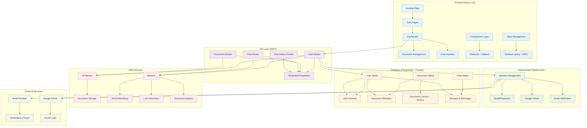
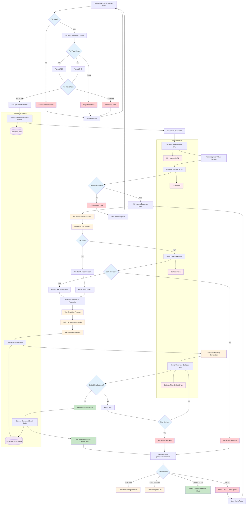
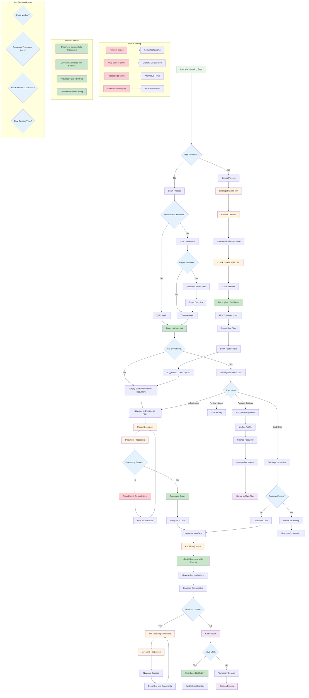
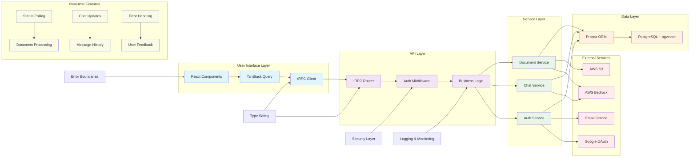
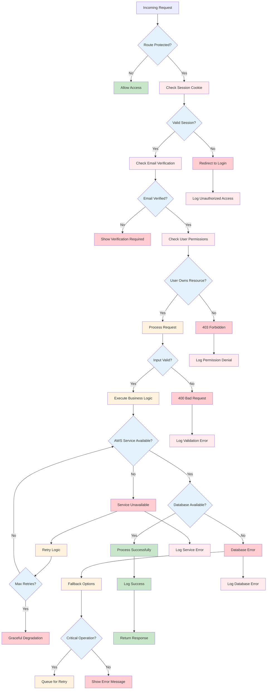

# Architectural Flow Diagrams

This document contains comprehensive architectural flow diagrams for the AI-powered document search application.

## 1. Main System Architecture Overview



## 2. Authentication Flow with Conditions

```mermaid
flowchart TD
    A[User Visits App] --> B{Authenticated?}

    B -->|No| C[Landing Page /]
    B -->|Yes| D{Email Verified?}

    C --> E[Click Login/Signup]
    E --> F{Choose Action}

    F -->|Login| G[/login Page]
    F -->|Signup| H[/signup Page]

    G --> I{Login Method}
    I -->|Email/Password| J[Email Login Form]
    I -->|Google| K[Google OAuth]

    J --> L{Valid Credentials?}
    L -->|No| M[Show Error Message]
    L -->|Yes| N{Email Verified?}

    K --> O{Google Auth Success?}
    O -->|No| P[OAuth Error]
    O -->|Yes| Q[Auto-verify Email]

    H --> R[Signup Form]
    R --> S{Form Valid?}
    S -->|No| T[Show Validation Errors]
    S -->|Yes| U[Create User Account]

    U --> V[Send Verification Email]
    V --> W[Show "Check Email" Message]

    W --> X[User Clicks Email Link]
    X --> Y[/verify-email Page]
    Y --> Z{Valid Token?}
    Z -->|No| AA[Show Error]
    Z -->|Yes| BB[Verify Email & Auto-login]

    N -->|No| CC[Redirect to Email Verification]
    N -->|Yes| DD[Create Session]
    Q --> DD
    BB --> DD

    DD --> EE[Redirect to /dashboard/chat]

    D -->|No| FF[Show "Please Verify Email"]
    D -->|Yes| GG[Access Dashboard]

    %% Password Reset Flow
    G --> HH[Forgot Password Link]
    HH --> II[/forgot-password Page]
    II --> JJ[Enter Email]
    JJ --> KK{User Exists?}
    KK -->|Yes| LL[Send Reset Email]
    KK -->|No| MM[Show "Email Sent" (Security)]

    LL --> NN[User Clicks Reset Link]
    NN --> OO[/reset-password Page]
    OO --> PP{Valid Token?}
    PP -->|Yes| QQ[New Password Form]
    PP -->|No| RR[Show Error]

    QQ --> SS[Update Password]
    SS --> TT[Redirect to Login]

    %% Session Management
    GG --> UU{Session Valid?}
    UU -->|No| VV[Redirect to Login]
    UU -->|Yes| WW[Access Protected Routes]

    %% Route Protection
    WW --> XX[Middleware Check]
    XX --> YY{Protected Route?}
    YY -->|Yes| ZZ{Session Valid?}
    YY -->|No| AAA[Allow Access]
    ZZ -->|Yes| BBB[Continue to Route]
    ZZ -->|No| CCC[Redirect to Login]

    %% Error Handling
    M --> G
    T --> H
    P --> G
    AA --> Y

    classDef success fill:#c8e6c9
    classDef error fill:#ffcdd2
    classDef decision fill:#fff3e0
    classDef process fill:#e1f5fe
    classDef external fill:#f3e5f5

    class DD,EE,GG,BBB,Q,BB success
    class M,P,T,AA,RR,VV,CCC error
    class B,D,F,I,L,O,S,Z,KK,PP,UU,YY,ZZ decision
    class U,V,X,Y,LL,SS,XX process
    class K,HH,II,NN,OO external
```

## 3. Document Processing Pipeline



## 4. RAG Query Flow

```mermaid
flowchart TD
    A[User Types Question in Chat] --> B[Submit Query]
    B --> C[Call chat.query tRPC Mutation]
    C --> D[Server Receives Query]

    D --> E{User Has Documents?}
    E -->|No| F[Return "No Documents" Message]
    E -->|Yes| G[Extract Keywords from Query]

    G --> H[Enhanced Keyword Search]
    H --> I[Search DocumentChunk Table]
    I --> J{Search Strategy}

    J -->|1| K[Exact Phrase Match]
    J -->|2| L[Individual Keyword Match]
    J -->|3| M[Title Match Bonus]

    K --> N[Score: High Weight]
    L --> O[Score: Medium Weight]
    M --> P[Score: Bonus Points]

    N --> Q[Combine All Scores]
    O --> Q
    P --> Q

    Q --> R[Apply Length Penalties]
    R --> S[Rank by Final Score]
    S --> T[Select Top 5 Chunks]

    T --> U{Relevant Chunks Found?}
    U -->|No| V[Return "No Relevant Info" Message]
    U -->|Yes| W[Format Context for LLM]

    W --> X[Build Structured Prompt]
    X --> Y[Include Source Attribution]
    Y --> Z[Send to Bedrock LLM]

    Z --> AA{LLM Response Success?}
    AA -->|No| BB[Handle LLM Error]
    AA -->|Yes| CC[Parse LLM Response]

    CC --> DD[Extract Answer Text]
    DD --> EE[Validate Source Citations]
    EE --> FF[Format Final Response]

    FF --> GG[Create ChatMessage Record]
    GG --> HH[Store User Question]
    HH --> II[Store Assistant Answer]
    II --> JJ[Store Source References]

    JJ --> KK[Return to Frontend]
    KK --> LL[Display Answer in Chat]
    LL --> MM[Show Source Cards]
    MM --> NN[Enable Source Navigation]

    %% Error Handling
    F --> OO[Show Empty State UI]
    V --> PP[Show "Ask Different Question"]
    BB --> QQ[Show "Try Again Later"]

    %% Source Display
    NN --> RR[User Clicks Source Card]
    RR --> SS[Highlight Document Section]
    SS --> TT[Show Full Context]

    %% Chat History
    KK --> UU{New Chat Session?}
    UU -->|Yes| VV[Create Session Record]
    UU -->|No| WW[Update Existing Session]

    VV --> XX[Generate Session Title]
    WW --> XX
    XX --> YY[Save to Database]

    %% Real-time Updates
    LL --> ZZ[Update Chat UI]
    ZZ --> AAA[Scroll to Bottom]
    AAA --> BBB[Focus Input Field]

    %% Scoring Algorithm Detail
    subgraph "Scoring Algorithm"
        CCC[Base Score = 0]
        DDD[Exact Phrase Match: +10]
        EEE[Keyword Frequency: +2 per match]
        FFF[Title Match: +5 bonus]
        GGG[Length Penalty: -0.1 per 100 chars]
        HHH[Final Score = Sum - Penalties]
    end

    %% Database Operations
    subgraph "Database Queries"
        I --> III[(LIKE queries on chunk_text)]
        GG --> JJJ[(ChatSession table)]
        HH --> KKK[(ChatMessage table)]
    end

    %% LLM Prompt Structure
    subgraph "LLM Prompt"
        LLL[System: You are a helpful assistant]
        MMM[Context: Top 5 relevant chunks]
        NNN[Question: User's original question]
        OOO[Instructions: Answer with sources]
    end

    classDef success fill:#c8e6c9
    classDef error fill:#ffcdd2
    classDef processing fill:#fff3e0
    classDef decision fill:#e3f2fd
    classDef llm fill:#f3e5f5
    classDef database fill:#e8f5e8

    class CC,DD,FF,LL,MM success
    class F,V,BB,OO,PP,QQ error
    class G,H,W,X,Y processing
    class E,J,U,AA,UU decision
    class Z,LLL,MMM,NNN,OOO llm
    class III,JJJ,KKK,GG,HH,II database
```

## 5. Complete User Journey Flow



## 6. Data Flow Architecture



## 7. Security & Error Handling Flow



---

These diagrams provide a comprehensive view of your application's architecture, showing all the major flows, decision points, and conditions. You can use these diagrams to:

1. **Understand the complete system architecture**
2. **Identify potential bottlenecks or failure points**
3. **Plan new features or modifications**
4. **Onboard new developers**
5. **Document the system for stakeholders**

Each diagram can be rendered using any Mermaid-compatible viewer, including GitHub, VS Code with the Mermaid extension, or online Mermaid editors.